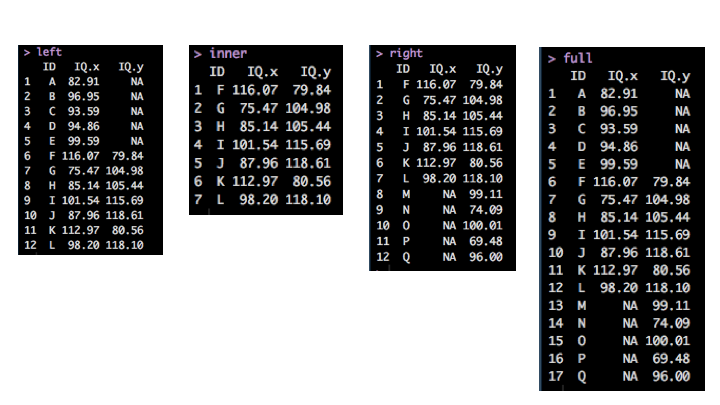
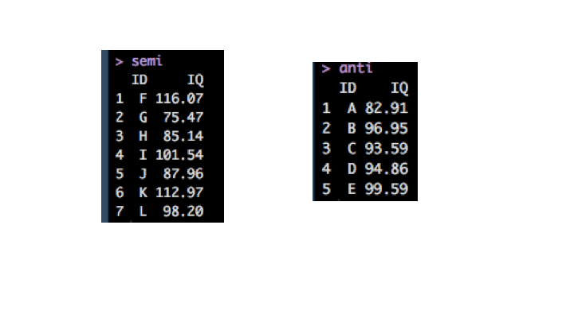
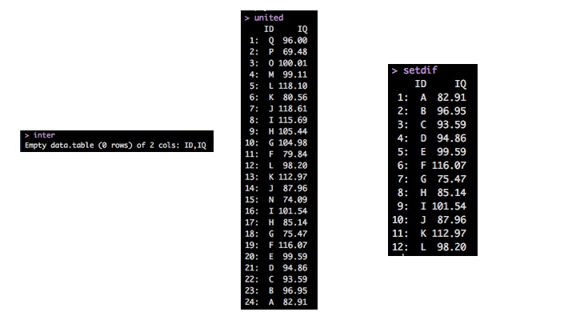

# What is joining?

We often run into scenarios where we need to join two dataframes together. Let's say we had some students who were given an IQ test at a career fair. Some of the students showed up at on both days, but not all. They were given unique alphabetic identifiers (A-Q).

Set up
```{r}
#install.packages('pacman')
pacman::p_load(knitr, kableExtra, formattable, data.table, dplyr, 
               rmarkdown, magrittr)
```

Make some data 
```{r, echo = T}
day1 =  data.table(ID=LETTERS[1:12], IQ=round(rnorm(12, 100, 15),2))

day2 =  data.table(ID=LETTERS[6:17],IQ=round(rnorm(12, 100, 20),2))
```
There are 12 individuals on day 1 and 12 individuals on day 2. 17 people have a single measurement while 5 have 2 measurements.

# Our data   

```{r, echo = F, results = 'asis'}
kable(list(day1, day2), 'html') %>% 
        kable_styling(full_width = F, font_size = 24)
```
Let's explore the three(ish) types of joins in `dplyr`

# Mutating joins  
#####  **add a new variables** to one table from matching rows in another

* `left_join`: prioritizes left df
* `right_join`: prioritizes righ df
* `inner_join`: only retains rows in both dfs
* `full_join`: retains all rows

Left, right and full joins are considered outer joins because when a row doesn't match in an outer new, the new variables are filled with missing values. 

# Filtering joins 
#####  **filter observations** from the primary based on whether they are present in the secondary table

* `semi_join`: retains rows in the primary table that are also present in secondary             table
* `anti_join`: retains rows in the primary that are not present in the secondary table

Filtering joins almost act like a filter in that the number of rows can change, bot not the columns. 

# Set operations 
##### ** combines operations**  in the dataset as if they were set elements   

* `intersect`:
* `union`:
* `setdiff`:


# Main arguments 

`right_join(x, y, by = NULL, copy = FALSE, suffix = c('.x', '.y'), ...)`

* `y` and `y` are the two dataframes we are joining 
* `by` = primary key variable (typically a unique identifier) which can be one or several columns. The foreign key is the indentifier in the secondary table, which will be matched to the primary tables based on the primary key.
* `copy` = 
* `suffix` will add a suffix to columns when they have the same name, e.g.`x.IQ` and `y.IQ`.

# Mutating joins 

```{r}
left = left_join(day1, day2, by = 'ID')
right = right_join(day1, day2, by = 'ID')
inner= inner_join(day1, day2, by = 'ID')
full = full_join(day1, day2, by = 'ID')
```



# Filtering joins 

```{r}
semi = semi_join(day1, day2, by = 'ID')
anti = anti_join(day1, day2, by = 'ID')
```




# Set operations 

```{r}
semi = semi_join(day1, day2, by = 'ID')
anti = anti_join(day1, day2, by = 'ID')
```



# dplyr versus ...

##### Base R 

`rbind`, and `cbind` 

* Slower than `dplyr`
* Can't handle lists of dataframes
* `rbind` returns an error when columns are not identical 
* `.id` arguments allows you to specify a name for each source dataframe

#### Data.table

While this point is contentious, if you've been a long standing tidyversalist, then you might find `data.table::merge` syntax more difficult to learn.   

Some people prefer `dplyr` because of its transparency 
* tells you what keys you're merging of (if not supplied)
* rows are kept in existing order
* also works with database tables 

# When joining can get tricky... 

- Joining with columns having the same name but different encoding (UTF-8 vs. Latin)
- Joining with columns having different storage types (factors, integers, bit64, dates)

# More!

There are additional types of joins not covered here: rolling joins, scaling joins

Rolling joins are used in circumstances where you want merging observations based on logical arguments (i.e. range of date). 

If you want to join 3 or more tables, go check out how a `list` and `reduce` from `base R` or `purrr::reduce` can help you.

# Thank-you 


