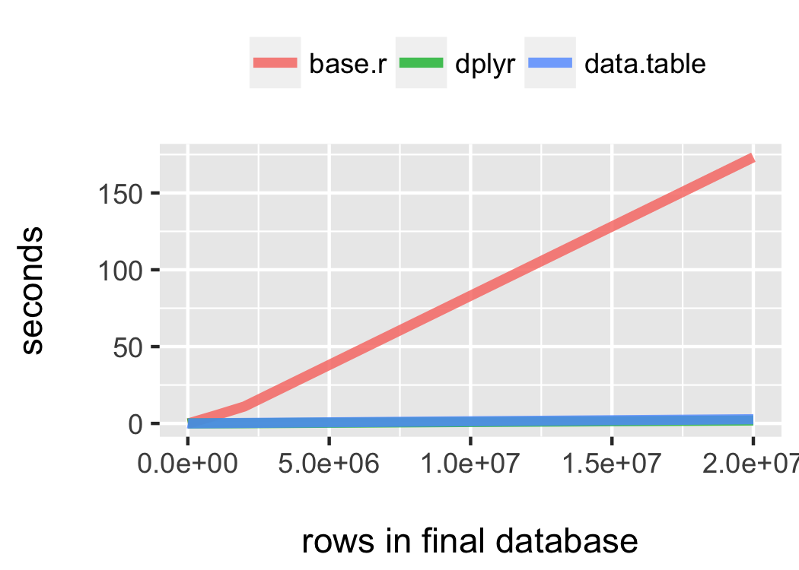

# What is joining?

We often run into scenarios where we need to join two data frames together. Let's say we had some students who were given an IQ test at a career fair. Some of the students showed up at on both days, but not all. They were given unique alphabetic identifiers (A-Q)

Set up
```{r}
#install.packages('pacman')
pacman::p_load(knitr, kableExtra, formattable, data.table, dplyr, 
               rmarkdown, magrittr, xtable)
```

Make some data 
```{r, echo = T}
day1 =  data.table(ID=LETTERS[1:12], IQ=round(rnorm(12, 100, 15),2))

day2 =  data.table(ID=LETTERS[6:17],IQ=round(rnorm(12, 100, 20),2))
```
There are 12 individuals on day 1 and 12 individuals on day 2. 17 people have a single measurement while 5 have 2 measurements

# Our data   

```{r, echo = F, results = 'asis'}
kable(list(day1, day2), 'html') %>% 
        kable_styling(full_width = F, font_size = 24)
```

Let's explore the three(ish) types of joins in `dplyr`

# Mutating joins  
#####  Add a new variables to one table from matching rows in another

* `left_join`: Primary key is left data frame
* `right_join`: Primary key is right data frame
* `inner_join`: Retains rows in both data frame
* `full_join`: Retains all rows

Left, right and full joins are considered outer joins because when a row doesn't match in an outer new, the new variables are filled with missing values 

# Filtering joins 
#####  Filter observations from the primary based on whether they are present in the secondary table

* `semi_join`: retains rows in the primary table that are also present in secondary table
* `anti_join`: retains rows in the primary that are not present in the secondary table

Filtering joins almost act like a filter in that the number of rows can change, but not the columns 

# Set operations 
##### Combines operations in the dataset as if they were set elements. Much like filtering joins, they do not add new columns. Set operations use combinations of observations from both data frames to create a new data frame  

* `intersect`: retains rows ONLY if they appear in both data frames
* `union`: retains rows that appear in EITHER data frames
* `setdiff`: retains rows that ONLY appear in the primary data frame but not the second


# Main arguments 

```{r, eval = FALSE}
right_join(x, y, by = NULL, copy = FALSE, suffix = c('.x', '.y'), ...)
```

* `y` and `y` are the two data frames we are joining 
* `by` = primary key variable (typically a unique identifier) which can be one or several columns. The foreign key is the indentifier in the secondary table, which will be matched to the primary tables based on the primary key.
* `copy` = copy values of 
* `suffix` will add a suffix to columns when they have the same name, e.g. `x.IQ` and `y.IQ`.

# Mutating joins: left join 

```{r}
left_join(day1, day2, by = 'ID') %>% 
        kable('html') %>% 
        kable_styling(font_size = 20)
```


# Mutating joins: right join 
```{r}
right_join(day1, day2, by = 'ID') %>% 
        kable('html') %>% 
        kable_styling(font_size = 20)
```

# Mutating joins: inner join 

```{r}
inner_join(day1, day2, by = 'ID') %>% 
        kable('html') %>% 
        kable_styling(font_size = 20)
```


# Mutating joins: full join
```{r}
full_join(day1, day2, by = 'ID') %>% 
        kable('html') %>% 
        kable_styling(font_size = 20)
```


# Filtering joins: semi join 

```{r}
semi_join(day1, day2, by = 'ID') %>% 
        kable('html') %>% 
        kable_styling(font_size = 20)
```

# Filtering joins: anti join 

```{r}
anti_join(day1, day2, by = 'ID') %>% 
        kable('html') %>% 
        kable_styling(font_size = 20)
```


# Set operations: intersect 

```{r}
intersect(day1, day2, by = 'ID') %>% 
        kable('html') %>% 
        kable_styling(font_size = 20)
```

# Set operations: union

```{r}
union(day1, day2, by = 'ID') %>% 
        kable('html') %>% 
        kable_styling(font_size = 20)
```

# Set operations: setdiff

```{r}
setdiff(day1, day2, by = 'ID') %>% 
        kable("html") %>% 
        kable_styling(font_size = 20)
```


# dplyr versus ...

##### Base R: `merge`

* Slower than `dplyr`
* Can't handle lists of data frames
* `rbind` returns an error when columns are not identical 
* `dplyr`'s `.id` argument allows you to specify a name for each source data frame

##### Data.table: `data.table::merge` 

While this point is contentious, if you've been a long standing tidyversalist, then you might find `data.table::merge` syntax more difficult to learn. Some people prefer `dplyr` because

* tells you what keys you're merging of (if not supplied)
* rows are kept in existing order
* also works with database tables 


# Benchmarking exercise


# When joining can get tricky... 

- Joining columns having the same name but different encoding (UTF-8 vs. Latin)
- Joining columns having different storage types (factors, integers, bit64, dates)


The consequences can vary, but dplyr might 

- Set all the values to NA
- Coerce a column to another type (e.g. factor to character)
- Fail to recognize columns that match resulting in rows being dropped

# More!


There are additional types of joins not covered here: rolling joins, scaling joins

Rolling joins are used in circumstances where you want to join observations based on logical arguments (i.e. range of date). 

If you want to join 3 or more tables, go check out how a `list` and `reduce` from `base R` or `purrr::reduce` can help you.


